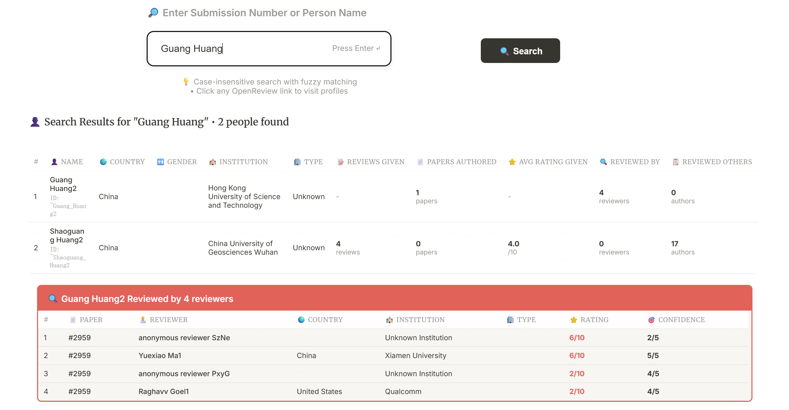
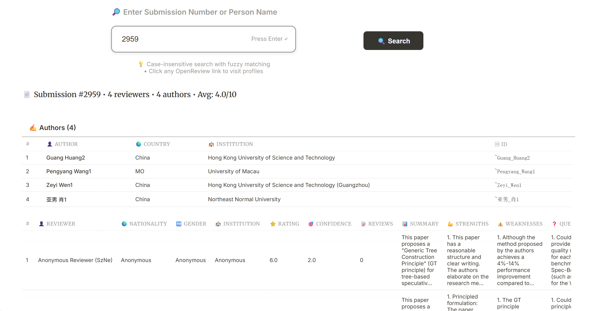
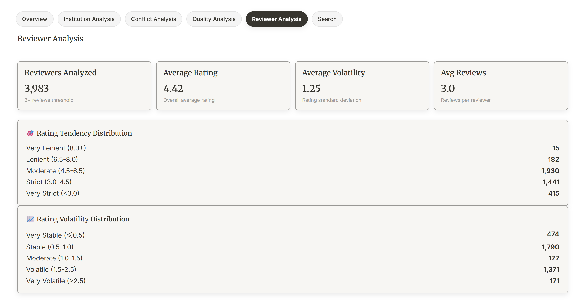
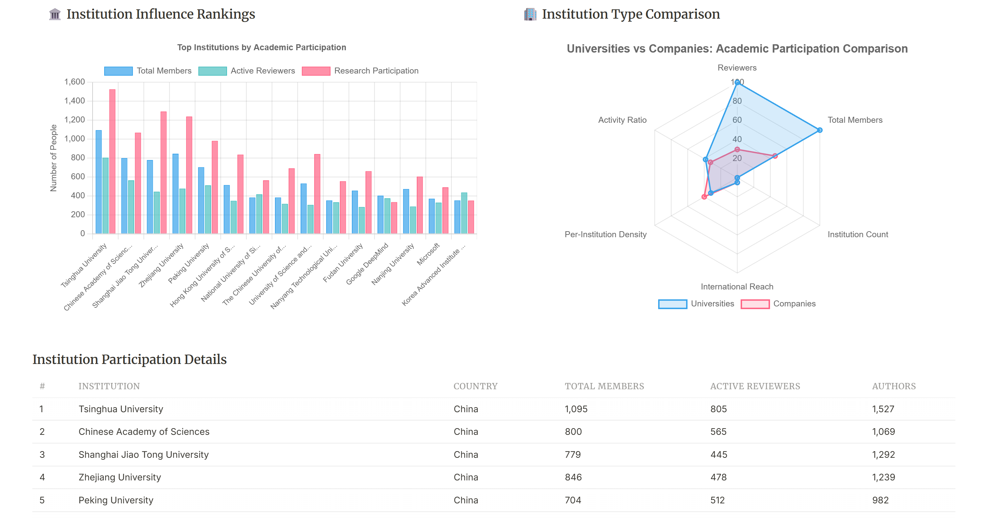

# ICLR Review Analysis Platform

<div align="center">


**English** | [简体中文](README.zh.md)

</div>

A comprehensive platform for analyzing peer review data from the International Conference on Learning Representations (ICLR). This tool provides insights into reviewer behavior, institutional analysis, and quality metrics of the peer review process.

## 🌐 Live Demo

**Access**: [http://10.123.4.17:3000/](http://10.123.4.17:3000/)

## 📸 Feature Showcase

<div align="center">

### 🔍 Intelligent Search Features

<table>
  <tr>
    <td width="50%" align="center">
      
      <br/><br/>
      <h4>👥 People Search</h4>
      <p><em>Search researchers by name, institution, nationality and more</em></p>
    </td>
    <td width="50%" align="center">
      
      <br/><br/>
      <h4>📄 Paper Search</h4>
      <p><em>Find submitted papers and related review information</em></p>
    </td>
  </tr>
</table>

### 📊 Data Analysis Features

<table>
  <tr>
    <td width="50%" align="center">
      
      <br/><br/>
      <h4>🔍 Reviewer Analysis</h4>
      <p><em>Analyze reviewer strictness, consistency, and bias patterns</em></p>
    </td>
    <td width="50%" align="center">
      
      <br/><br/>
      <h4>🏫 Institution Analysis</h4>
      <p><em>Institutional influence and geographical distribution analysis</em></p>
    </td>
  </tr>
</table>

</div>

## 🚀 Features

- **Reviewer Analysis**: Analyze reviewer strictness, consistency, and bias patterns
- **Institutional Insights**: Explore geographical distribution and institutional influence
- **Quality Metrics**: Comprehensive quality analysis of reviews and submissions
- **Interactive Visualizations**: Rich charts and graphs for data exploration
- **Community Features**: Discussion board for research community
- **Statistical Analysis**: Advanced statistical tools for review data

## 📊 Data Analysis Capabilities

- Reviewer strictness and consistency analysis
- Geographic distribution of reviewers and authors
- Institutional influence metrics
- Review quality assessment
- Conflict of interest detection
- Academic diversity analysis

## 🛠️ Tech Stack

- **Frontend**: Next.js 14, React 18, Tailwind CSS
- **Authentication**: Better Auth with Google/GitHub OAuth
- **Database**: PostgreSQL with connection pooling
- **Charts**: Chart.js with React Chart.js 2
- **UI Components**: Radix UI primitives
- **Data Processing**: Python scripts for analysis

## 📋 Prerequisites

- Node.js 18+ and npm/yarn
- PostgreSQL database

## 🔧 Data preparation & installation

1. **Prepare and enrich raw reviews**
   - Start from a reviews JSONL file that includes submission, author, and `reviewer_id` data (for example: `iclr2026_reviews_10000.jsonl`).
   - Run the enrichment helpers to add missing organization and country information:
     ```bash
     python scripts/enrich_institutions_optimized.py  # fill in institution names
     python scripts/enrich_country.py                 # append country details
     ```
     You can extend these enrichers (or add new ones) to include extra attributes such as gender when available.

2. **Convert to the platform schema**
   ```bash
   python scripts/convert_data.py
   ```
   This produces the `review-data` folder that matches the expected data schema.

3. **Clone the repository**
   ```bash
   git clone https://github.com/RegiaYoung/ICLR_Analysis.git
   cd ICLR_Analysis
   ```

4. **Install dependencies**
   ```bash
   npm install
   ```

5. **Set up environment variables**
   ```bash
   cp .env.example .env.local
   ```
   Edit `.env.local` with your configuration:
   - Database connection string (local PostgreSQL or Neon)
   - OAuth credentials (optional)
   - Better Auth secret

6. **Initialize the database schema**
   ```bash
   npm run init-db
   ```

7. **Import JSON data into the database**
   ```bash
   npm run migrate-json-final
   ```

8. **Generate static assets for the web app**
   ```bash
   node scripts/generate-static-from-json.js
   ```

9. **Start the development server**
   ```bash
   npm run dev
   ```

Open [http://localhost:3000](http://localhost:3000) to view the application.

## 📁 Project Structure

```
├── app/                    # Next.js app router pages
├── components/            # React components
│   ├── charts/           # Chart components
│   └── ui/              # UI primitives
├── lib/                  # Utility libraries
├── scripts/              # Data processing scripts
├── static-analysis-data/ # Pre-computed analysis results
├── asserts/              # Project screenshots and demos
└── public/              # Static assets
```

## 🔑 Environment Variables

| Variable | Description | Required |
|----------|-------------|----------|
| `DATABASE_URL` | PostgreSQL connection string | Yes |
| `BETTER_AUTH_SECRET` | Secret key for authentication | Yes |
| `NEXT_PUBLIC_APP_URL` | Your app URL | No |

## 📊 Data Schema

The platform expects review data in the following format:
- **Reviews**: submission_number, reviewer_id, rating, confidence, text
- **People**: person_id, name, nationality, gender, roles, institutions
- **Institutions**: institution_name, country, type
- **Submissions**: submission details and metadata

## 🤝 Contributing

1. Fork the repository
2. Create a feature branch: `git checkout -b feature/your-feature`
3. Commit your changes: `git commit -m 'Add your feature'`
4. Push to the branch: `git push origin feature/your-feature`
5. Open a Pull Request

## 📄 License

This project is licensed under the MIT License - see the [LICENSE](LICENSE) file for details.

## 🙏 Acknowledgments

- ICLR conference organizers for providing review data
- OpenReview platform for transparency in peer review
- Research community for valuable feedback

## 🔒 Privacy & Ethics

This platform is designed for academic research purposes. Please ensure:
- Proper anonymization of sensitive data
- Compliance with data protection regulations
- Ethical use of review data
- Respect for reviewer and author privacy

## 📞 Support

For questions or support, please:
- Open an issue on GitHub
- Check existing documentation
- Review the troubleshooting guide

---

**Note**: This is a research tool intended for academic analysis of peer review processes. Please use responsibly and in accordance with applicable data protection and research ethics guidelines.
